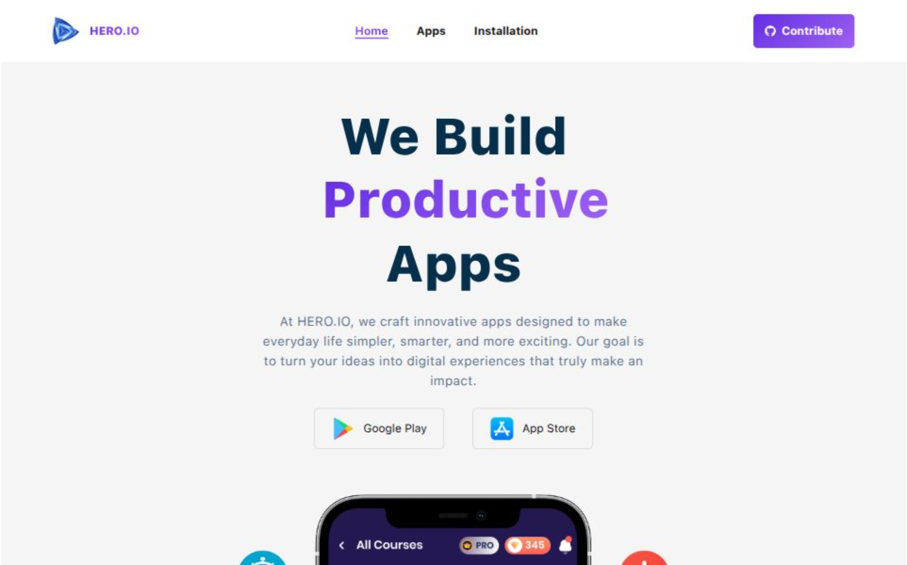

📖 Overview  This is a modern React-based web application
built with React, Tailwind CSS, and React Router. It includes dynamic features
such as sorting, searching, local storage handling, and responsive design for a
seamless user experience.

🚀 Features

✅ Clean and responsive UI (built with Tailwind CSS) ✅ Dynamic sorting and
filtering ✅ LocalStorage-based data persistence ✅ Custom hooks for data
fetching (useDatas) ✅ Loading states and error handling ✅ Toast notifications
for actions ✅ Recharts-based data visualization
